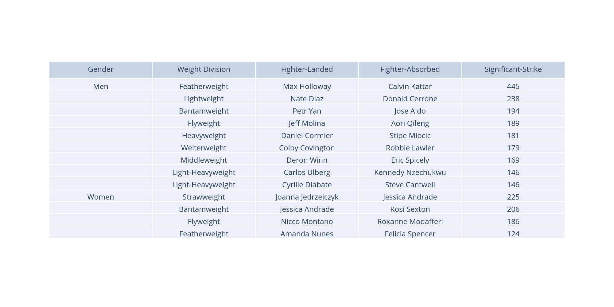

## Most significant strikes in a single UFC fight (by gender and weight division)

### Kaggle dataset can be found [here](https://www.kaggle.com/bloodprashure/ufc-p4p-1-dataset).

Data is true as of May 8th, 2021 (UFC Fight Night: Rodriguez vs. Waterson).

